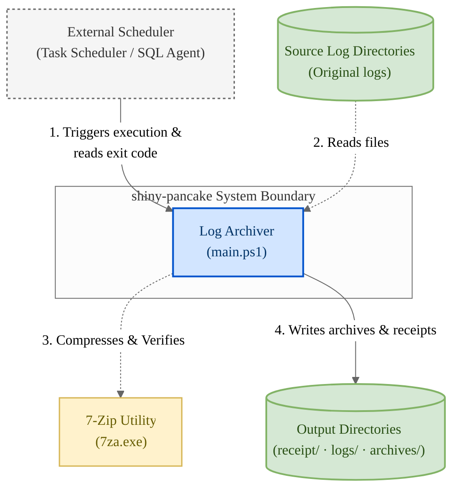
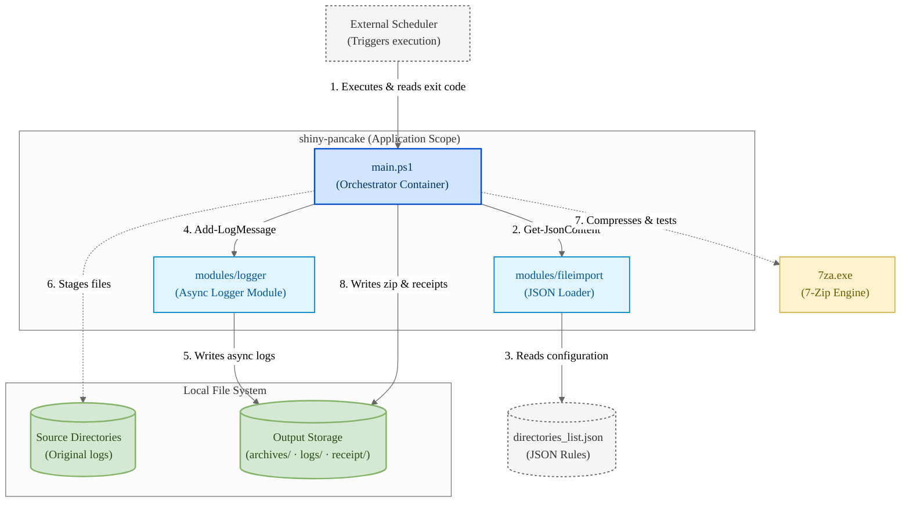
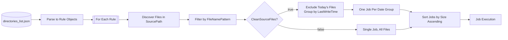
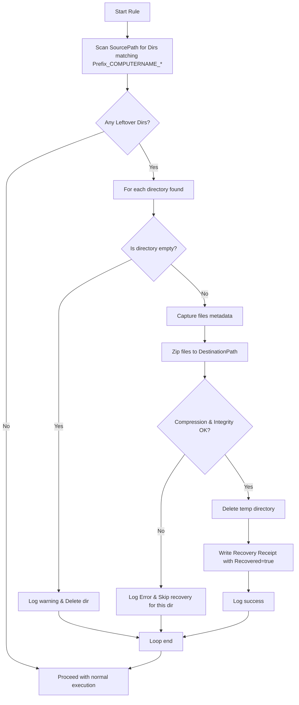
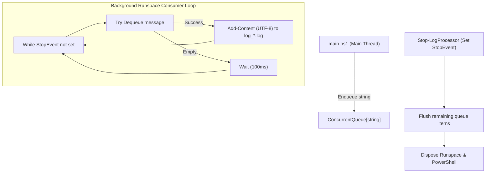

# Log Rotation & Archiving Script — System Architecture & Design

This document describes the **system architecture, design patterns, and internal mechanisms** of the log rotation and archiving script. It covers the structure of the system, data models, and key architectural decisions. 

For the step-by-step logic, decision branching, and flowcharts, see the companion [FLOWCHARTS.md](FLOWCHARTS.md).

---

## 1. System Context

The script operates as a standalone utility, typically executed by an external scheduler (e.g., Windows Task Scheduler, SQL Server Agent, or cron-like triggers). The scheduler drives execution, while the script reports results back via standard streams and a deterministic exit code.



---

## 2. Container Architecture

The system consists of three internal components and two external interfaces:



### Components

*   **`main.ps1` (Orchestrator)**: The script's entry point. It manages prerequisites verification, resource throttling, rule evaluation, job scheduling, execution pre-flights, staging, compression invocation, integrity validation, cleanup, and receipt generation.
*   **`modules/logger` (Async Logger)**: Implements a thread-safe producer-consumer logging model. Logging actions run asynchronously in a background runspace to prevent disk I/O bottlenecks from blocking the main orchestrator loop.
*   **`modules/fileimport` (JSON Loader)**: Houses `Get-JsonContent`, which reads raw file content using UTF-8 encoding and converts it into structured PowerShell objects (`ConvertFrom-Json`).
*   **`bin/7zip/7za.exe` (External Binary)**: Standalone 7-Zip command-line executable. Chosen for its portable nature, high compression ratio, and built-in integrity testing (`t` command).

---

## 3. Resource Throttling & Affinity Masking

To ensure the script does not starve the host system's CPU and memory, the script features a best-effort resource throttling system. It lowers process priority and calculates a CPU affinity mask.

### Bitwise Affinity Calculation

The script limits CPU cores by constructing a bitwise processor affinity mask using `[int64]` integers to maintain Windows PowerShell 4 compatibility:

```text
AllowedCores = max(1, floor(TotalCores * (CpuPercent / 100.0)))
ShiftCores   = TotalCores - AllowedCores
Mask         = (2^AllowedCores - 1) * 2^ShiftCores
```

These bitwise operations shift the active bits to the **highest indexed CPU cores**, leaving the lower-indexed cores (e.g., Core 0 and Core 1) free for operating system and foreground interactive tasks.

### Process Priority Classes

The process priority class is adjusted dynamically using the .NET `Diagnostics.Process` API. Supported values include:
*   `Idle` (lowest impact)
*   `BelowNormal` (default configuration)
*   `Normal` (standard process execution)
*   `AboveNormal`
*   `High`

> [!NOTE]
> Throttling is applied on a **best-effort** basis. If the script is executed in an environment where permission restrictions prevent changing priority or affinity (e.g., restricted containers), the script logs a warning and proceeds with normal execution.

---

## 4. Data Model & Job Orchestration

The script parses the raw configuration rules and expands them into executable units of work called **Jobs**.



### Rotation Mode (`CleanSourceFiles = $true`)
*   **Today's Exclusion**: Files modified on the current calendar day are skipped. This avoids zipping files that are actively being written to by applications.
*   **Date Grouping**: Files are grouped by their `LastWriteTime` date using the formatting string `dd-MM-yy`.
*   **Multi-Job Generation**: The rule generates one independent job per unique date group.

### Keep Mode (`CleanSourceFiles = $false`)
*   **Single-Job Generation**: All discovered files matching the pattern are processed together in a single job.
*   **Current Date Suffix**: The archive is named after the current execution date.

### Smallest-First Job Ordering
Jobs within a rule are sorted in **ascending order of their uncompressed bytes** (`SizeBytes`). This ordering strategy provides two major advantages:
1.  **Optimal Storage Recovery**: On space-constrained disks, processing smaller files first successfully clears source space (in rotation mode) faster.
2.  **Early Termination**: If a small job fails the free-space check, it acts as a gate: larger jobs will also not fit and can be skipped immediately.

---

## 5. Disk-Space Pre-Flight Calculations

Before staging any files, the script performs a strict disk space check to prevent running out of space during compression (which could leave partial archives or corrupted structures).

### Required Space Formulas

*   **Destination Volume Requirements ($Req_{dest}$)**:
```text
Req_dest = EstimatedArchiveBytes + ExistingArchiveBytes + SpaceSafetyBufferBytes
```
    
    *   `EstimatedArchiveBytes`: Calculated by applying `ExpectedCompressionPercent` to the total size of the job files:
```text
EstimatedArchiveBytes = JobBytes * (1 - ExpectedCompressionPercent / 100)
```
    *   `ExistingArchiveBytes`: If an archive for the same target date already exists, 7-Zip will perform an update/append operation. The script must reserve space equal to the size of the existing archive since 7-Zip creates a temporary copy during updates.
    *   `SpaceSafetyBufferBytes`: A static safety margin set to `256MB` by default.

*   **Source Volume Requirements ($Req_{src}$)** (Only evaluated when `CleanSourceFiles = $false`):
```text
Req_src = JobBytes
```
    
    *   In copy mode (Keep), files are duplicated to a temp folder residing under `SourcePath`. This requires enough space on the source disk to store a second copy of all files.
    *   In move mode (Rotation), files are moved into the temp folder. Since the temp folder lives on the same volume, this metadata-only rename requires virtually $0$ bytes of additional disk space.

---

## 6. Staging, Compression, & Integrity Verification

To guarantee zero data loss, the staging and zipping flow is structured to isolate failures:

1.  **Temp Directory Staging**: Files are placed in a directory named after the target archive base (e.g., `<prefix>_<COMPUTERNAME>_<date>_<suffix>`).
    *   **Move Mode**: Files are moved via `[System.IO.File]::Move()`. If a file is locked, it falls back to copying and logs a warning.
    *   **Copy Mode**: Files are copied via `[System.IO.File]::Copy()`.
2.  **No Native Deletions during Archiving**: The script invokes `7za.exe` without the `-sdel` (source delete) flag. Deletion is managed entirely by PowerShell *after* validation.
3.  **Working Directory Relativization**: Before zipping, the script temporarily changes the working directory (both PowerShell location and process CWD) to the temp directory. This forces 7-Zip to store files with **flat/bare filenames**, avoiding deep folder hierarchy pollution inside the zip.
4.  **Integrity Gate**: Once zipping completes, the script runs `7za.exe t <Archive>` to verify archive integrity. Only when the test returns exit code `0` is the temp staging directory deleted.
5.  **Rollback**: If compression fails or the integrity test returns a non-zero code, the temp directory is **left in place** on disk. This preserves the original staged logs and sets up the folder for crash recovery.

---

## 7. Crash Recovery (Leftover Temp Directories)

When a run is aborted or interrupted (e.g., due to system power loss, process termination, or disk errors), a staging temp directory remains in the source path. The orchestrator automatically handles these during rule initialization:



This recovery pass ensures that logs staged during a crashed execution are not lost, but are safely archived, verified, and cleaned up before new jobs begin.

---

## 8. Error Isolation & Exit Code Mapping

Errors are isolated at three nested scopes to prevent a single failure from crashing the entire process:

```
[Global Scope]
   │
   ├── [Rule Scope] (For each rule)
   │      │
   │      └── [Job Scope] (For each job inside a rule)
```

| Scope | Failure Impact | Recovery Action |
|---|---|---|
| **Job Scope** | Skips the current job. Larger jobs in the same rule are also skipped if caused by a space limit. | Deletes a fresh partial archive if created; leaves the temp directory intact. |
| **Rule Scope** | Skips the current rule and proceeds to the next rule in the configuration list. | Cleans up rule-specific state. |
| **Global Scope** | Summarizes errors and warnings and completes execution. | Flushes the queue, stops the background runspace, and writes the summary log. |

### Exit Code Mapping

The scheduler inspects the exit code to determine job health. The global `finally` block maps the run's logged metrics to the exit code:

*   **Exit Code `0` (Clean)**: Completed with no errors and no warnings.
*   **Exit Code `1` (Warnings)**: Script completed, but one or more warnings were logged (e.g., resource throttling failed, locked files fallback, or no files found under a non-mandatory rule).
*   **Exit Code `2` (Errors)**: Critical failure occurred (e.g., config parsing failure, 7-zip missing, disk space exhaustion, or a mandatory rule had no files matching its pattern).

---

## 9. Asynchronous Logger Architecture

Disk writes to log files are offloaded to a background thread to maximize execution speed:



*   **Producer-Consumer Pattern**: Main orchestrator calls `Add-LogMessage`, which increments counts (`WarnCount`/`ErrorCount`) and enqueues a formatted log string.
*   **Thread Safety**: Handled by .NET's thread-safe `ConcurrentQueue`.
*   **Flush Guarantee**: When `Stop-LogProcessor` is called, it signals the thread to stop and performs a final dequeue loop to write any remaining logs before disposing resources.

This architectural description covers all components, math formulas, and design criteria of the archiving script.
