# Log Rotation & Archiving Script — Flowchart Diagrams

Companion to [ARCHITECTURE.md](ARCHITECTURE.md): that document covers **structure** (system context, containers, resource bitmask, space calculations); this one covers the **step-by-step runtime flows**.

> [!NOTE]
> Mermaid diagrams render natively in GitHub, GitLab, Notion, Obsidian, and VS Code (with the Mermaid Preview extension).

---

## 1. Top-Level Execution Flow

The high-level lifecycle of the script execution from start to finish.

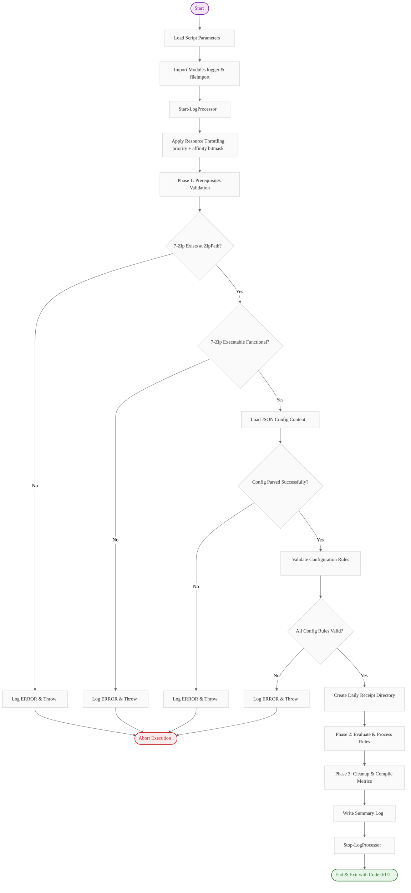

---

## 2. Prerequisites Validation

Pre-flight checks executing prior to processing rules.

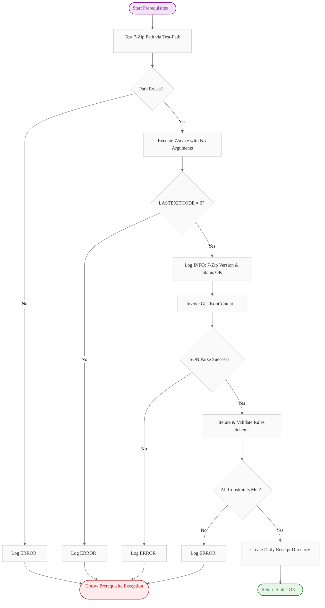

---

## 3. Config Validation (Per Rule)

Schema and type validation applied to each configuration rule in the array.

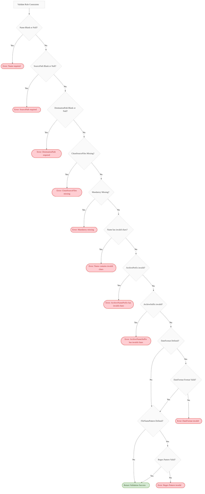

---

## 4. Rule Processing Flow

Orchestration sequence for an individual rule. Leftover recovery is performed prior to scanning files.

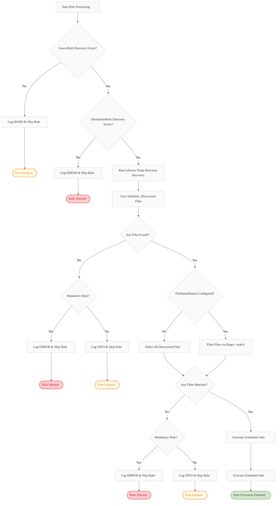

---

## 5. Job Generation (CleanSourceFiles Branching)

How files are grouped and sorted into distinct jobs depending on clean vs. keep mode.

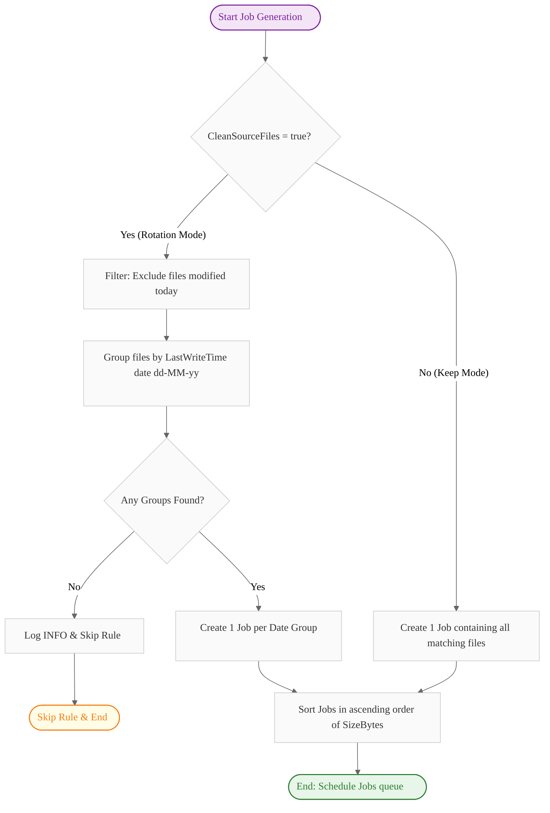

---

## 6. Job Execution (Per Job)

Processing loop for a single generated job. Space check and integrity testing act as safety gates.

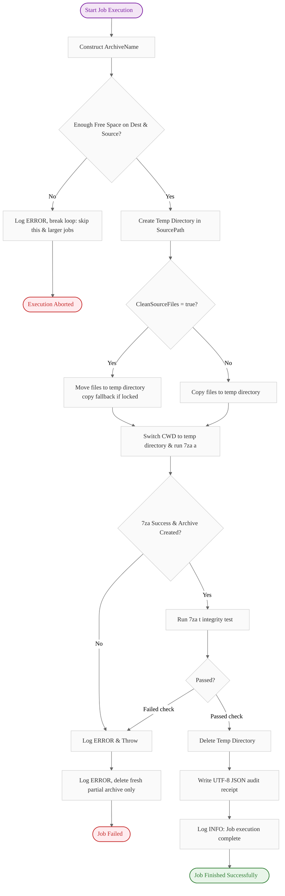

---

## 7. Archive Name Construction

Formatting resolution for archive file names.

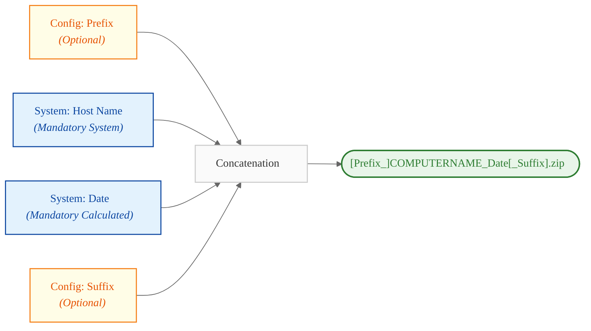

---

## 8. Receipt File Structure

Detailed layout of audit receipts stored under `receipt/YYYY-MM-DD/`.

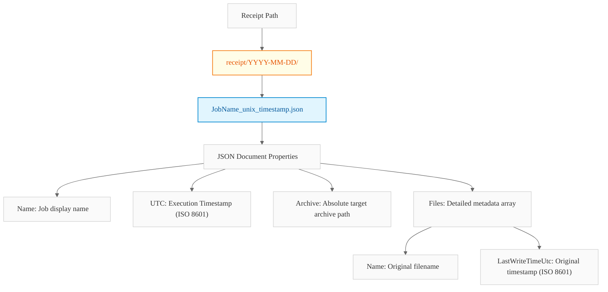

---

## 9. Error Handling Hierarchy

Nested try/catch/finally boundaries isolating failures.

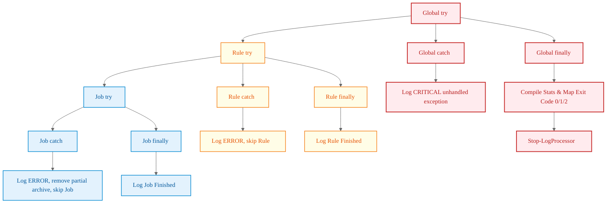

---

## 10. Async Logger Architecture

Producer-consumer runspace cycle isolating logging I/O.

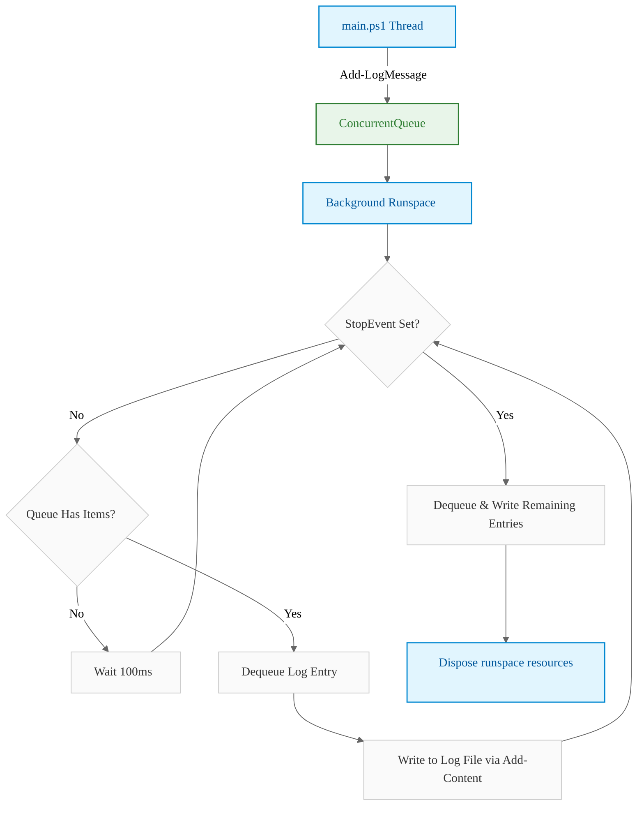

---

## 11. CleanSourceFiles = true — File Lifecycle

Staging and removal lifecycle when rotation mode is active.

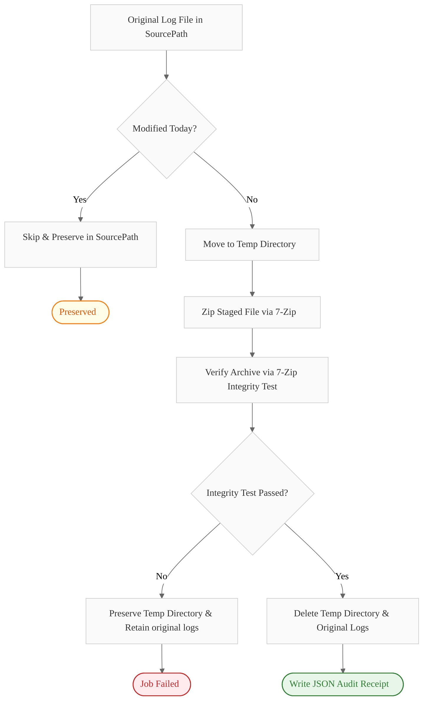

---

## 12. CleanSourceFiles = false — File Lifecycle

Staging lifecycle when keep mode is active.

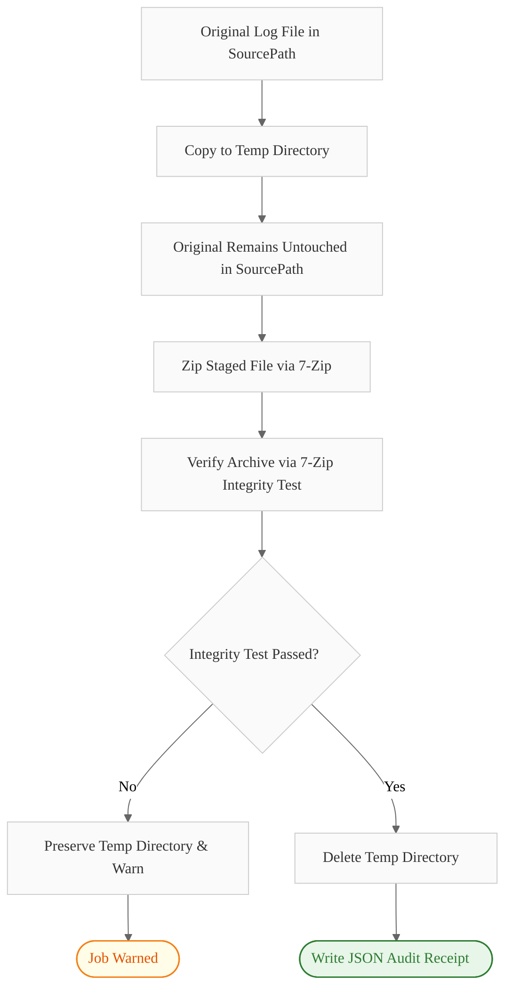

---

## 13. Full Rule Processing — Decision Tree

Decisions traversed during rule evaluation.

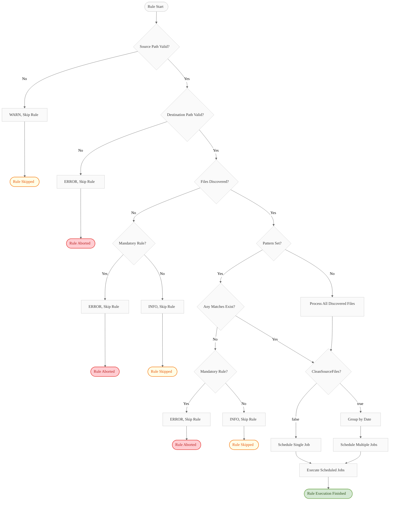

---

## 14. Leftover Temp Directory Recovery Flow

Automatic recovery execution addressing crashed or terminated runs.

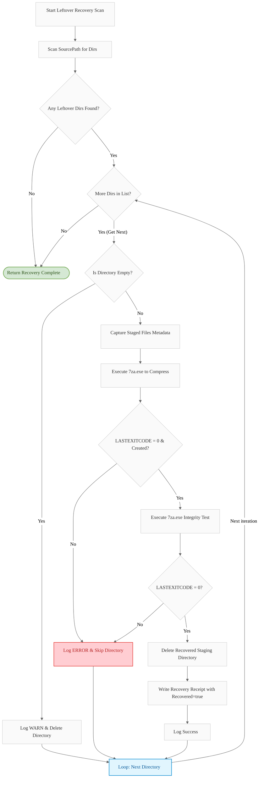

---

## Diagram Legend

Visual guides representing node shapes in Mermaid flowcharts.

| Symbol Shape | Logical Interpretation |
|---|---|
| `flowchart TD` | Top-to-bottom layout |
| `flowchart LR` | Left-to-right layout |
| `[ ]` | Action, Process, or Command execution |
| `{ }` | Condition, Decision, or Branching logic |
| `([ ])` | Terminal boundary (Start / End) |
| `-->` | Sequential flow connection |
| `|label|` | Condition/Branch match label |

---

## Rendering Tips

Information on how to visualize these charts locally or on hosting platforms:

*   **VS Code**: Install the **Markdown Preview Mermaid Support** extension to view diagrams directly inside markdown previews.
*   **GitHub/GitLab**: Diagrams render natively inside standard `.md` views.
*   **Notion**: Paste the raw `mermaid` code block and select the Mermaid renderer.
*   **Obsidian**: Mermaid diagrams render automatically in reading/editing modes.
*   **CLI / Static Sites**: Use `mermaid-cli` (`mmdc`) to build and export diagrams to static `PNG` or `SVG` formats.