# Log Rotation & Archiving Script — Flowchart Diagrams

Companion to `ARCHITECTURE.md` — these Mermaid diagrams visualize the script's logic flows.

> **Note:** Mermaid diagrams render in GitHub, GitLab, Notion, Obsidian, and VS Code with the Mermaid Preview extension.

---

## 1. Top-Level Execution Flow

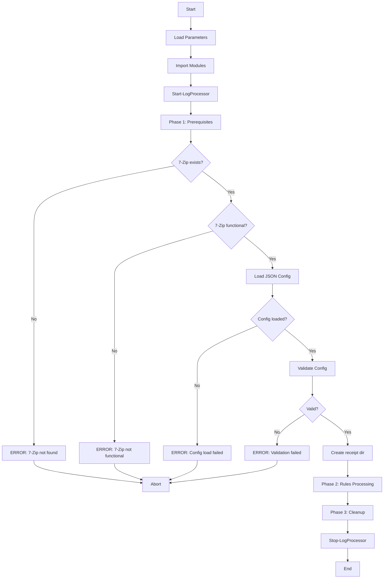

---

## 2. Prerequisites Validation

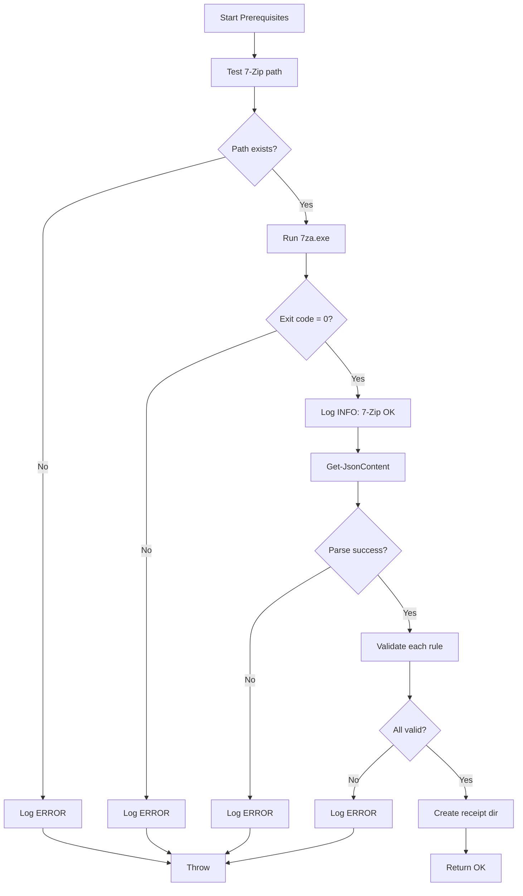

---

## 3. Config Validation (Per Rule)

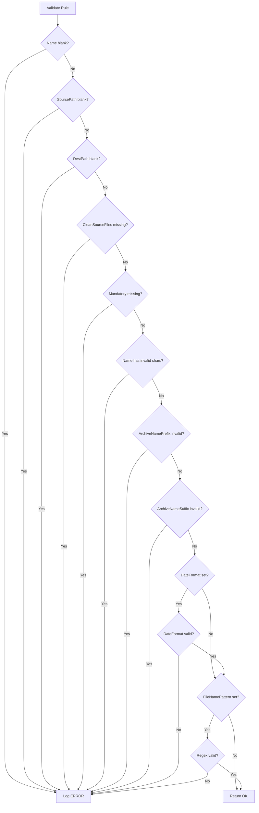

---

## 4. Rule Processing Flow

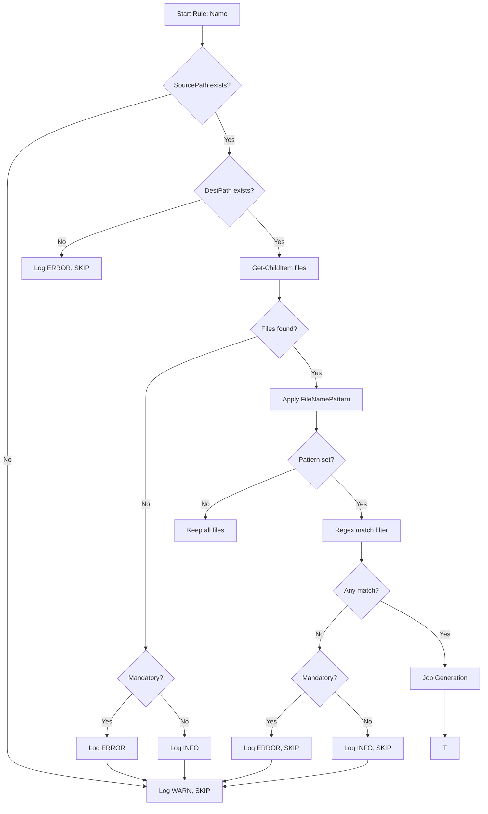

---

## 5. Job Generation (CleanSourceFiles Branching)

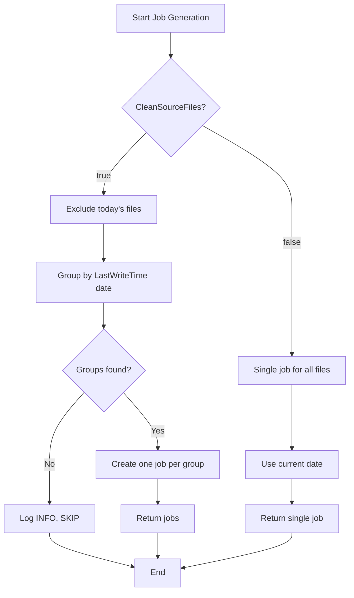

---

## 6. Job Execution (Per Job)

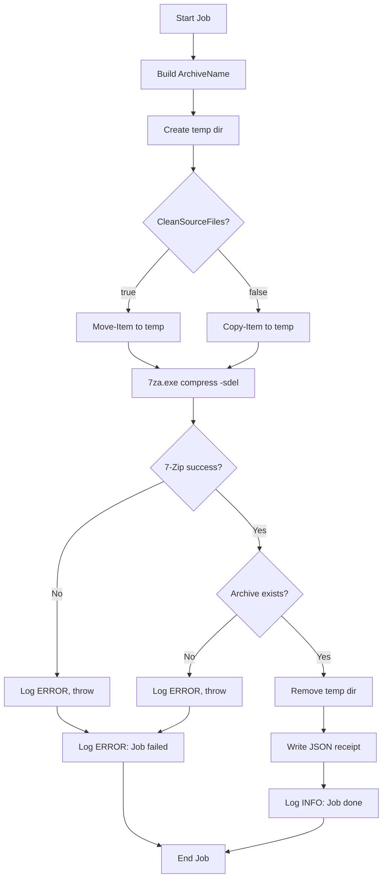

---

## 7. Archive Name Construction

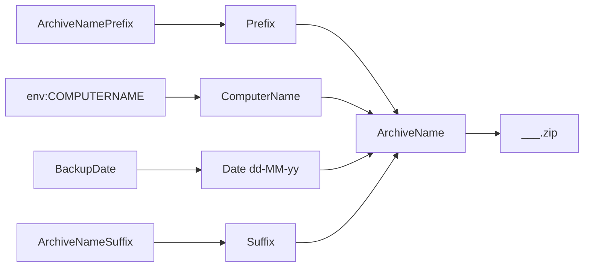

---

## 8. Receipt File Structure

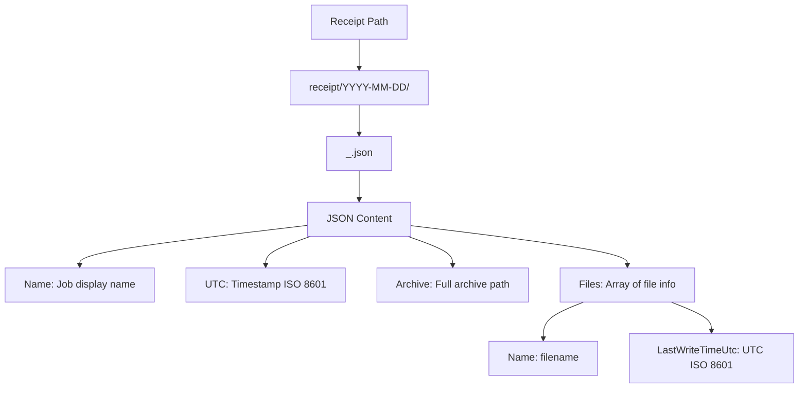

---

## 9. Error Handling Hierarchy

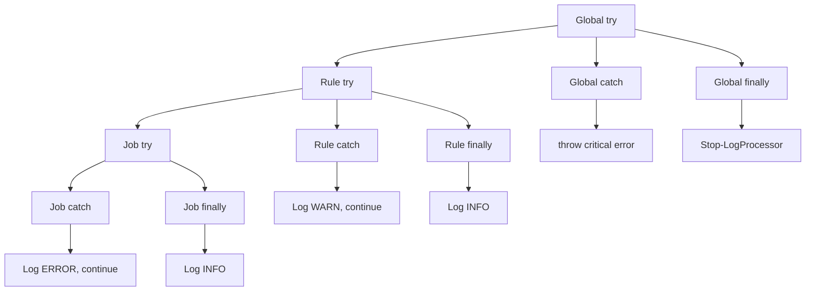

---

## 10. Async Logger Architecture

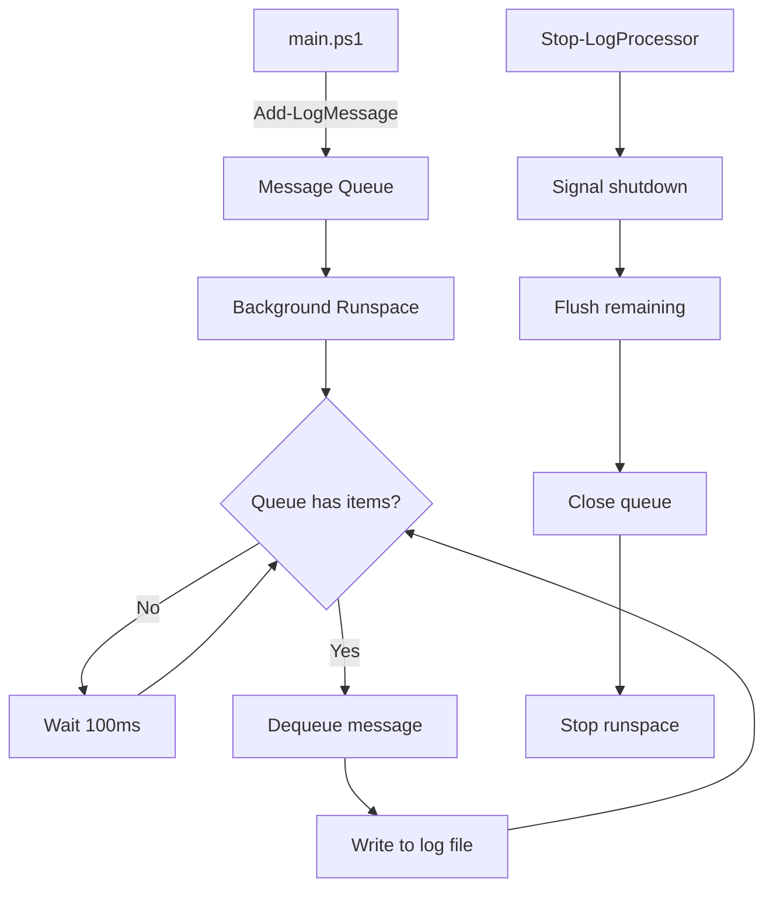

---

## 11. CleanSourceFiles = true — File Lifecycle

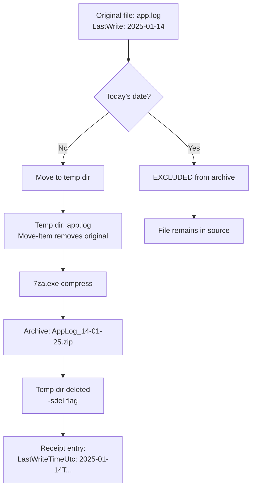

---

## 12. CleanSourceFiles = false — File Lifecycle

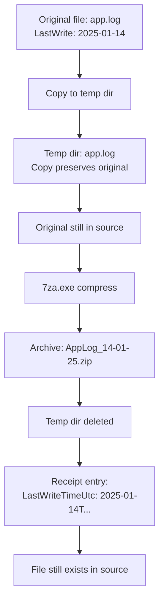

---

## 13. Full Rule Processing — Decision Tree

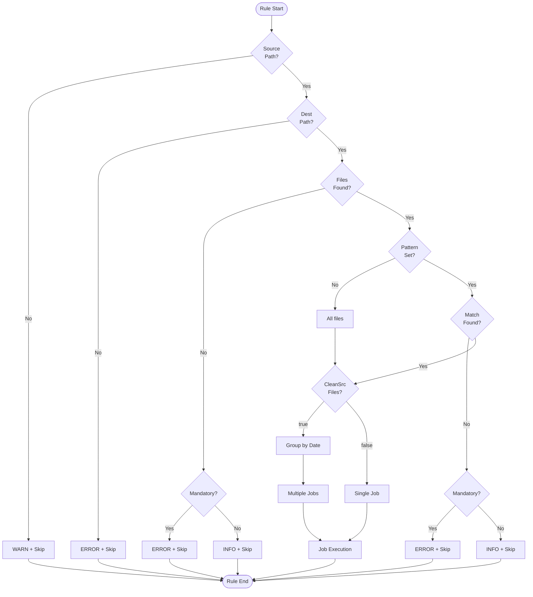

---

## Diagram Legend

| Symbol | Meaning |
|---|---|
| `flowchart TD` | Top-to-bottom layout |
| `flowchart LR` | Left-to-right layout |
| `[]` | Process / Action |
| `{}` | Decision / Condition |
| `([ ])` | Start / End |
| `-->` | Flow direction |
| `|Yes\|No\|true\|false\|...` | Branch label |

---

## Rendering Tips

- **VS Code**: Install the "Markdown Preview Mermaid Support" extension
- **GitHub/GitLab**: Mermaid renders natively in `.md` files
- **Notion**: Paste the raw `mermaid` code block
- **Obsidian**: Mermaid diagrams render automatically
- **Static sites**: Use `mermaid-cli` (`mmdc`) to export to PNG/SVG